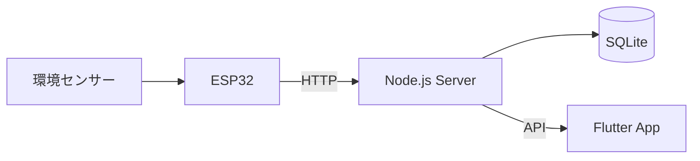

# 植物見守り (Plant Environment Monitoring)

## 概要

植物の育成環境をリアルタイムで見守るIoTシステムです。

専用センサーデバイス(ATOM Matrix)で取得した温度・湿度・土壌水分・照度を、スマートフォンアプリ「植物見守り」に送信し、植物の状態をひと目で確認できるように可視化します。
「普段は何もしなくていい。必要な時だけ、そっと知らせる」をコンセプトに、初心者でも安心して植物を育てられる環境づくりを目指しています。

---

## 開発目標

本プロジェクトでは、

- IoTデバイス開発(センサー・ハードウェア設計)
- ATOM Matrixとアプリ間の通信(Wi-Fi / HTTP)
- Flutterアプリ開発
- センサーデータの可視化・デザインシステム構築

を通して、植物の育成をサポートするプロダクトを一気通貫で構築することを目指しています。

---

## コンセプト

> 植物のことを、ずっと気に掛けなくてもいい。
> 必要な時だけ、そっと知らせる見守りアプリ。

- **状態をひと目で**:アイコンと短いメッセージで植物の状態を直感的に把握
- **優先度が高い植物を上に**:注意・要ケアの植物をリストの上部に表示
- **今日のまとめで全体を把握**:平均の環境データをコンパクトに表示
- **静かに見守る**:通知は必要な時だけ。毎日開かなくてもいい安心感

---

## 特徴

- 温度・湿度・土壌水分・照度をリアルタイム表示
- 状態を3段階のアイコン(元気・少し乾いている・乾燥している)で見える化
- 環境データの履歴をグラフで確認
- 状態悪化時のみ通知するアラート機能
- ATOM Matrixベースの専用センサーデバイスとのIoT連携
- Flutterによるスマートフォンアプリ(iOS / Android)

---

## 使用技術

| 分類 | 技術 |
|---|---|
| アプリ | Flutter |
| サーバー | Node.js |
| データベース | SQLite |
| デバイス | ATOM Matrix, Arduino |
| センサー | M5Stack用温湿度気圧センサユニット Ver.3（ENV Ⅲ）、M5Stack用土壌水分センサユニット [U019]、M5Stack用光センサユニット [U021] |
| 通信 | Wi-Fi 2.4GHz / HTTP(JSON) |

---

## システム構成



---

## 画面構成

本アプリは以下の5画面を中心に構成されます。

| # | 画面 | 内容 |
|---|---|---|
| 1 | ホーム | 植物一覧・状態・今日のまとめを表示→個別の状態を表示 |
| 2 | 植物詳細 | 植物登録、登録した植物を編集 |
| 3 | 履歴 | 過去の環境データをグラフで表示 |
| 4 | 通知/アラート | 状態悪化時の通知一覧 |
| 5 | 設定 | デバイス接続・各種設定 |

### 画面イメージ

ホーム画面(ペーパープロトタイプ)


その他のデザイン資料(ユーザーフロー、デザインシステム、デバイス外観・内部構成)は `docs/images/` を参照してください。

---

## プロダクト(デバイス)概要

専用のIoTセンサーデバイスを植木鉢に挿して使用します。

- サイズ:約35mm × 18mm × 98mm(突起部含まず)/ 重量:約30g
- 電源:小型モバイルバッテリー
- 開発モジュール:ATOM Matrix
- 拡張:ATOM PortABC拡張ベース
- センサー:M5Stack用温湿度気圧センサユニット Ver.3（ENV Ⅲ）、M5Stack用土壌水分センサユニット [U019]、M5Stack用光センサユニット [U021]
- カラーバリエーション:ミルクホワイト / セージグリーン / グレージュ(3Dプリンターを使用して型番作成から配色まで行いたいです)
- ステータスLEDで動作状態を色で通知(緑:正常 / 橙:注意 / 赤:エラー)

詳細は[設計書](docs/system-design.md)を参照してください。

---

## 現在の進捗

- ✅ Figmaデザイン(画面デザイン・デザインシステム・ユーザーフロー・デバイス外観)
- ✅ Flutter UI試作(5画面・植物詳細遷移・共通テーマ)
- ✅ Flutter Widgetテスト・GitHub Actions
- ⬜ Node.js実装
- ⬜ ESP32連携

---

## ディレクトリ構成

```
project
├── .github/    GitHub Actions
├── docs/       設計・企画資料
└── app/        Flutterアプリ(Android / iOS)
```

`server/`と`esp32/`は今後追加予定です。

---

## 詳細資料

- [企画書](docs/concept.md)
- [要件定義](docs/requirements.md)
- [設計書](docs/system-design.md)

---

## Flutterアプリの起動

Flutter SDKは`app/pubspec.yaml`で**3.41.9**に固定しています。対応するDart SDKは**3.11.5**です。

```bash
cd app
flutter pub get
flutter run
```

静的解析とテストは次のコマンドで実行できます。

```bash
flutter analyze
flutter test
```

Androidで実行する場合はAndroid StudioとAndroid SDK、iOSで実行する場合はmacOSとXcodeが必要です。詳細は[`app/README.md`](app/README.md)を参照してください。

---

## 環境変数

本プロジェクトでは、環境変数を `.env` ファイルで管理します。

初回セットアップ時は、`.env.example` をコピーして `.env` を作成してください。

```bash
cp .env.example .env
```

Windowsの場合

```cmd
copy .env.example .env
```

必要に応じて `.env` の内容を編集してください。

※ `.env` は機密情報を含むため GitHub にはコミットしません。
