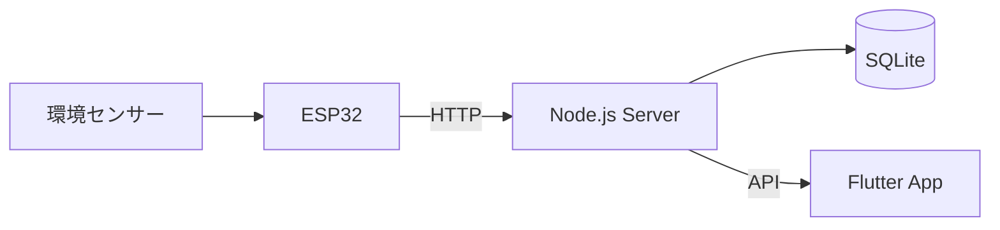

# 植物見守り (Plant Environment Monitoring)

## 概要

植物の育成環境をリアルタイムで見守るIoTシステムです。

専用センサーデバイス(ATOM Matrix)で取得した温度・湿度・土壌水分・照度を、スマートフォンアプリ「植物見守り」に送信し、植物の状態をひと目で確認できるように可視化します。
「普段は何もしなくていい。必要な時だけ、そっと知らせる」をコンセプトに、初心者でも安心して植物を育てられる環境づくりを目指しています。

---

## 開発目標

本プロジェクトでは、

- IoTデバイス開発(センサー・ハードウェア設計)
- ATOM Matrixとアプリ間の通信(Wi-Fi / HTTP)
- Flutterアプリ開発
- センサーデータの可視化・デザインシステム構築

を通して、植物の育成をサポートするプロダクトを一気通貫で構築することを目指しています。

---

## コンセプト

> 植物のことを、ずっと気に掛けなくてもいい。
> 必要な時だけ、そっと知らせる見守りアプリ。

- **状態をひと目で**:アイコンと短いメッセージで植物の状態を直感的に把握
- **優先度が高い植物を上に**:注意・要ケアの植物をリストの上部に表示
- **今日のまとめで全体を把握**:平均の環境データをコンパクトに表示
- **静かに見守る**:通知は必要な時だけ。毎日開かなくてもいい安心感

---

## 特徴

- 温度・湿度・土壌水分・照度をリアルタイム表示
- 状態を3段階のアイコン(元気・少し乾いている・乾燥している)で見える化
- 環境データの履歴をグラフで確認
- 状態悪化時のみ通知するアラート機能
- ATOM Matrixベースの専用センサーデバイスとのIoT連携
- Flutterによるスマートフォンアプリ(iOS / Android)

---

## 使用技術

| 分類 | 技術 |
|---|---|
| アプリ | Flutter |
| サーバー | Node.js(Express) |
| データベース | SQLite |
| 認証 | Firebase Authentication(メール/パスワード) |
| Push通知 | Firebase Cloud Messaging(FCM、Android先行対応) |
| デバイス | ATOM Matrix, Arduino |
| センサー | M5Stack用温湿度気圧センサユニット Ver.3（ENV Ⅲ）、M5Stack用 土壌水分センサユニット(Unit Earth、U019)※、照度センサー BH1750※2 |
| 通信 | Wi-Fi 2.4GHz / HTTP(JSON) |

※ 土壌水分センサーは当初M5Stack用土壌水分センサユニット(U019、抵抗式)を使用していましたが、接続不良と判断し一時DFRobot Gravity 防水静電容量式土壌水分センサー V2.0(SEN0308、静電容量式)へ変更しました。その後の再検証で、異常値の主因は培養土との相性(電極接触ムラ)であり砂状の媒体では安定動作することが判明したため、M5シリーズでの機材統一を優先しU019+砂運用へ最終的に変更しました。電極の防錆・防水非対応による長期耐久性のリスクは許容した上での採用です。詳細は[デバイス検証ログ](docs/device-test-log.md)を参照してください。

※2 光センサーは当初M5Stack用光センサユニット(U021)を候補としていましたが、拡張ベース経由でのI2C/ADCピン競合・ピン不足の懸念から見送り、BH1750(ENV IIIとは別のI2Cバス経由)へ変更しました。詳細は[設計書 8章](docs/system-design.md#8-デバイス設計)を参照してください。

---

## システム構成



---

## 画面構成

本アプリは以下の5画面を中心に構成されます。

| # | 画面 | 内容 |
|---|---|---|
| 1 | ホーム | 植物一覧・状態・今日のまとめを表示→個別の状態を表示 |
| 2 | 植物詳細 | 植物登録、登録した植物を編集 |
| 3 | 履歴 | 過去の環境データをグラフで表示 |
| 4 | 通知/アラート | 状態悪化時の通知一覧 |
| 5 | 設定 | デバイス接続・各種設定 |

### 画面イメージ

ホーム画面(ペーパープロトタイプ)


その他のデザイン資料(ユーザーフロー、デザインシステム、デバイス外観・内部構成)は `docs/images/` を参照してください。

---

## プロダクト(デバイス)概要

専用のIoTセンサーデバイスを植木鉢に挿して使用します。

- サイズ:約35mm × 18mm × 98mm(突起部含まず)/ 重量:約30g
- 電源:小型モバイルバッテリー
- 開発モジュール:ATOM Matrix
- 拡張:ATOM PortABC拡張ベース
- センサー:M5Stack用温湿度気圧センサユニット Ver.3（ENV Ⅲ）、M5Stack用 土壌水分センサユニット(Unit Earth、U019、砂ポケット運用)、M5Stack用光センサユニット [U021]
- カラーバリエーション:ミルクホワイト / セージグリーン / グレージュ(3Dプリンターを使用して型番作成から配色まで行いたいです)
- ステータスLEDで動作状態を色で通知(緑:正常 / 橙:注意 / 赤:エラー)

詳細は[設計書](docs/system-design.md)を参照してください。

---

## 現在の進捗

- ✅ Figmaデザイン(画面デザイン・デザインシステム・ユーザーフロー・デバイス外観)
- ✅ Flutter UI試作(5画面・植物情報遷移・共通テーマ)
- ✅ Flutter Widgetテスト・GitHub Actions
- ✅ Node.js実装(plants / sensor / history / notifications API)
- ✅ アプリ⇔サーバーの実接続(`HttpPlantRepository`、ダミーデータから切り替え済み)
- ✅ 状態悪化時の通知自動生成・履歴表示との連携動作確認
- ✅ ENV Ⅲ(温湿度)のWi-Fi送信コード実装
- ✅ ESP32実機からの送信テスト(現状はPCからの手動送信でサーバー〜アプリ間を確認済み)
- ✅ 土壌水分(U019、砂ポケット運用)の実接続
- ✅ デバイスペアリング機能の実装
- ✅ 照度センサー(BH1750)の実接続、状態判定・通知への組み込み
- ✅ 温度・湿度・照度の状態判定(適正/注意/要ケア)・通知ロジック(詳細は[status-notification-design.md](docs/status-notification-design.md)を参照)
- ✅ 植物種ごとの管理条件(季節別の土壌水分閾値。モンステラ・パキラ・サンセベリア・ポトスの4種に対応)
- ✅ 季節別水やり条件(季節別閾値・継続時間による判定の遅延・水やり履歴による緩和)
- ✅ 通知ロジック完成(サイレントタイム、カテゴリ別ON/OFF、複数項目同時悪化時の1件集約まで対応)
- ✅ 水やり記録機能(ホーム画面の「水やりした」ボタン、履歴一覧・グラフへの反映は保留中)
- ✅ 植物の新規登録画面(F-08)。`AppRoot`が植物未登録を検知すると自動でこの画面へ振り分け、送信すると`POST /plants`まで接続済み(`app/lib/screens/onboarding/plant_registration_page.dart`)。セットアップ時に`curl`コマンドで手動登録する必要はない
- ✅ Push通知(Firebase Cloud Messaging(FCM)、Android先行対応。ログイン後にトークン登録、フォアグラウンドはバナーを出さず通知一覧のみ即時更新、バックグラウンド/終了状態はOS標準のシステム通知。詳細は[push-notification-design.md](docs/push-notification-design.md)を参照)
- ⬜ Bluetooth Low Energy(BLE)は未着手(現状はデバイス名・MACアドレスの手入力でペアリング)
- ✅ v2:ログイン機能(Firebase Authenticationによるメール/パスワード認証。本人確認のゲートのみで、ユーザーごとのデータ分離は行わないパターンAでの実装)
- ✅ v2:セキュリティ強化(サーバーAPIにFirebaseのIDトークン検証ミドルウェアを追加(`server/middleware/require_auth.js`)。`POST /sensor`のみESP32向けに別方式(`DEVICE_API_KEY`によるデバイス認証、`server/middleware/require_device_auth.js`)で保護。設計は[v2-firebase-security-design.md](docs/v2-firebase-security-design.md)を参照)
- ✅ v2でのFirebase移行(ログイン機能・サーバーAPIの保護・Push通知(FCM)まで完了。Node.jsサーバーは置き換えず、`firebase-admin`経由で拡張する方針で確定・実装した)
- ✅ 植物種カタログの拡充(モンステラ・パキラ・サンセベリア・ポトスの4種、`GET /species`。育てたい植物を1種選んで登録・あとから植物情報ページで切り替えも可能。今後も種類を拡大予定)
- ⬜ v2で複数植物(複数株)対応にする(例:モンステラとパキラを同時に2株登録して、それぞれ個別に見守る。サーバー側のAPI/DB(`plants`テーブル)は複数行に対応済みだが、アプリは引き続き`GET /plants`の先頭1件のみを表示・管理する実装のままで、2株目を追加する画面もまだ無い。上記の「植物種カタログ」とは別の課題で、こちらは未着手)
- ⬜ v2で複数デバイス対応にする(1台のデバイスにつき植物1株、という前提自体が上記の複数植物対応と合わせて解消が必要)
- ⬜ ユーザーごとにBLEでデバイスをペアリング・紐付けし、他ユーザーは紐付けていないデバイス/植物を扱えないようにする想定。新規登録ボタン(`LoginPage`)はこの方針に伴い意図的に開放したまま。詳細・残課題は[v2-firebase-security-design.md](docs/v2-firebase-security-design.md)を参照)

---

## ディレクトリ構成

```
project
├── .github/    GitHub Actions
├── docs/       設計・企画資料・プレゼン資料
├── app/        Flutterアプリ(Android / iOS)
├── server/     APIサーバー(Node.js + SQLite)
└── esp32/      センサーデバイス用スケッチ(Arduino)
```

---

## 詳細資料

- [企画書](docs/concept.md)
- [要件定義](docs/requirements.md)
- [設計書](docs/system-design.md)
- [状態判定・通知設計](docs/status-notification-design.md)
- [Push通知(FCM)設計](docs/push-notification-design.md)
- [v2 セキュリティ・Firebase設計](docs/v2-firebase-security-design.md)
- [デバイス検証ログ](docs/device-test-log.md)

---

## プレゼン資料

本プロジェクトの概要や開発背景、システム構成、アプリケーションの特徴についてまとめています。

📄 [プレゼン資料を見る](docs/presentation/植物見守り_展示発表資料.pdf)

---

## Flutterアプリの起動

Flutter SDKは`app/pubspec.yaml`で**3.41.9**に固定しています。対応するDart SDKは**3.11.5**です。

アプリはNode.jsサーバー(`server/`)と通信するため、先にサーバーを起動しておく必要があります。詳しい手順は[`app/app-README.md`](app/app-README.md)を参照してください。

```bash
cd app
flutter pub get
flutter run
```

静的解析とテストは次のコマンドで実行できます。

```bash
flutter analyze
flutter test
```

Androidで実行する場合はAndroid StudioとAndroid SDK、iOSで実行する場合はmacOSとXcodeが必要です。詳細は[`app/app-README.md`](app/app-README.md)を参照してください。

---

## 環境変数

本プロジェクトでは、環境変数を `.env` ファイルで管理します。

初回セットアップ時は、`.env.example` をコピーして `.env` を作成してください。

```bash
cp .env.example .env
```

Windowsの場合

```cmd
copy .env.example .env
```

必要に応じて `.env` の内容を編集してください。

※ `.env` は機密情報を含むため GitHub にはコミットしません。

### サーバー用の追加設定(v2・認証機能を使う場合)

サーバーAPIの保護(認証、詳細は[v2-firebase-security-design.md](docs/v2-firebase-security-design.md)を参照)を有効にするには、`.env` に以下2つの値の設定が必須です。未設定のままだと`node app.js`自体は起動できてしまいますが、アプリからのAPIリクエストが全て401(認証エラー)になり、原因が分かりにくいので注意してください。

| 変数 | 内容 | 取得方法 |
|---|---|---|
| `GOOGLE_APPLICATION_CREDENTIALS` | Firebase Admin SDKのサービスアカウント鍵(JSON)ファイルへの絶対パス | [Firebase Console](https://console.firebase.google.com/) → 対象プロジェクト → プロジェクトの設定 → サービスアカウント タブ → 「新しい秘密鍵の生成」でJSONファイルをダウンロードし、そのファイルへの絶対パスを指定する。このJSONファイル自体は機密情報のため、リポジトリ管理外(`.gitignore`対象)の場所に置くこと |
| `DEVICE_API_KEY` | ESP32から`POST /sensor`を送信する際のデバイス認証キー(任意の長い文字列) | 自分で長めのランダム文字列を生成して設定する(例: `openssl rand -hex 32`)。`esp32/plant_sensor_integrated/secrets.h`側の`DEVICE_API_KEY`にも同じ値を設定すること |

設定後、`node app.js`を起動した際にコンソールへ`Firebase IDトークンの検証に失敗しました: Unable to detect a Project Id...`のような警告が出る場合は、`GOOGLE_APPLICATION_CREDENTIALS`のパスが誤っているか、指定したファイルが存在しない可能性があります。
