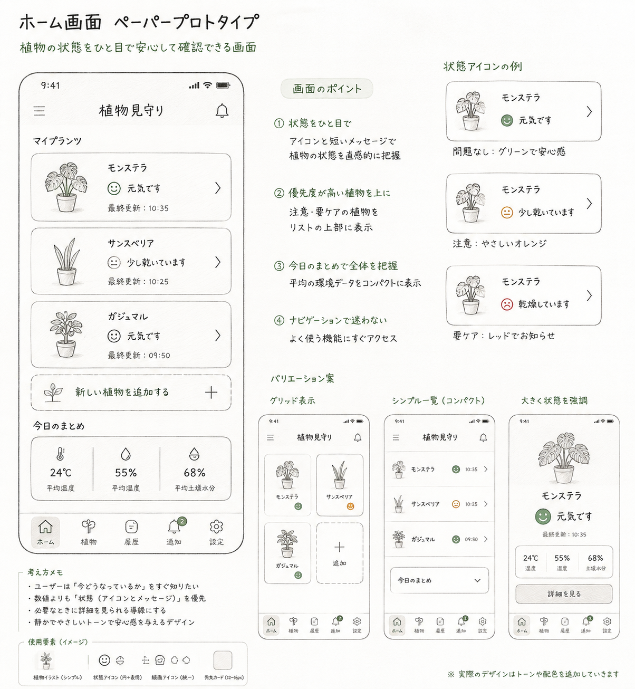

# Plant Environment Monitoring

## 概要

植物の育成環境をリアルタイムで確認できるIoTシステムです。

ESP32で取得した温湿度や土壌水分などの環境データをスマートフォンアプリに表示し植物の状態を分かりやすく可視化します。
植物の管理をサポートし、初心者でも育成しやすい環境づくりを目指しています。

---

## 開発目標

本プロジェクトでは、

- IoTシステム開発
- ESP32との通信
- Flutterアプリ開発
- センサーデータの可視化

を通して、植物の育成をサポートするシステムの構築を目指しています。

---

## 特徴

- 温湿度・土壌水分をリアルタイム表示
- 植物の状態を見える化
- 環境データの履歴確認
- ESP32とのIoT連携
- Flutterによるスマートフォンアプリ

---

## 使用技術

Flutter
Node.js
SQLite
ESP32
Arduino
HTTP通信

---

## システム構成

graph LR

A[環境センサー]
B[ESP32]
C[Node.js Server]
D[(SQLite)]
E[Flutter App]

A --> B
B -->|HTTP| C
C --> D
C -->|API| E

---

## 画面イメージ

ホーム画面

---

## 現在の進捗

✅ Figmaデザイン作成中
⬜ Flutter実装
⬜ Node.js実装
⬜ ESP32連携

---

## ディレクトリ構成

docs/
app/
server/
esp32/

---

## 詳細資料

- [企画書](docs/concept.md)
- [要件定義](docs/requirements.md)
- [設計書](docs/system-design.md)
