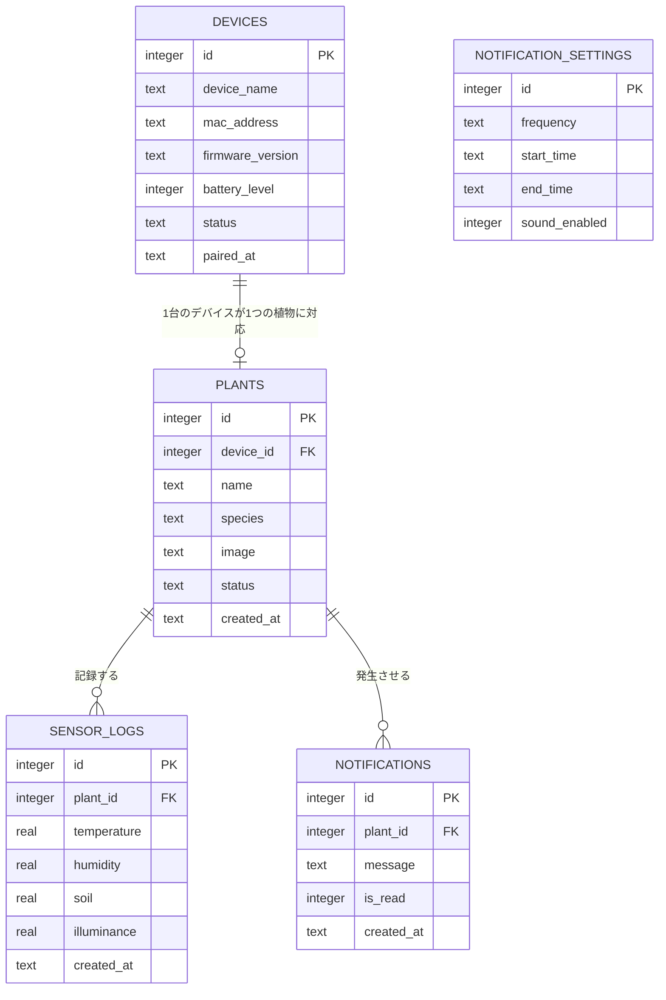

# 設計書

## 1. システム構成

```
センサー(温湿度・土壌水分・照度)
  │
  ▼
ESP32(センサーデバイス)
  │ HTTP(JSON)
  ▼
Node.js(APIサーバー)
  │
  ├── SQLite
  │
  ▼
Flutter(アプリ)
```

## 2. ディレクトリ構成

```
project
│
├── app
│   ├── screens
│   │   ├── home
│   │   ├── plant_detail
│   │   ├── history
│   │   ├── notification
│   │   └── settings
│   ├── widgets
│   ├── models
│   ├── services
│   └── main.dart
│
├── server
│   ├── routes
│   ├── database
│   ├── controllers
│   └── app.js
│
├── esp32
│   └── main.ino
│
└── docs
```

## 3. 画面設計

アプリは以下5画面で構成する。

```
ホーム(植物一覧・今日のまとめ)
 ├─▶ 植物詳細(植物登録・センサー値・履歴ボタン)
 │     └─▶ 履歴(グラフ表示)
 ├─▶ 通知/アラート(通知一覧 → 詳細確認)
 └─▶ 設定/植物登録(デバイス接続・各種設定)
```

### 3-1. ホーム画面

- マイプランツ一覧(カード形式:植物名・状態アイコン・最終更新時刻)
- 状態アイコンは3段階(元気 / 少し乾いている / 乾燥している)で表示し、要注意の植物ほど上位に表示する
- 「今日のまとめ」として平均温度・平均湿度・平均土壌水分を表示
- 「新しい植物を追加する」導線を配置
- ボトムナビゲーション:ホーム / 植物 / 履歴 / 通知 / 設定

### 3-2. 植物詳細画面

- 植物名・状態(アイコン+メッセージ)・最終更新時刻
- 温度・湿度・土壌水分をカード形式で表示
- 履歴画面への導線

### 3-3. 履歴画面

- 土壌水分・温度・湿度の推移をグラフ表示
- 期間(直近など)でのデータ確認

### 3-4. 通知/アラート画面

- 状態悪化時の通知一覧(例:「土壌水分が少なくなっています」)
- 通知タップで植物詳細へ遷移し、対応後は状態が更新される

### 3-5. 設定/植物登録画面

- デバイス接続(Bluetooth/Wi-Fiでのペアリング)
- 植物登録(植物名・植物種の入力)
- 通知設定(通知頻度・通知時間帯・通知音)
- デバイス設定(デバイス名・バッテリー残量・ファームウェア確認)
- ヘルプ・サポート

## 4. ユーザーフロー

> 本バージョンは認証機能を実装しない単一ユーザー構成のため、アカウント作成/ログインのステップは設けない([要件定義書 9章](requirements.md#9-制約事項)を参照)。

```
①アプリ起動 → ②デバイス接続 → ③植物の登録 → ④ホーム画面(通常時)
                                                        │
                                    ⑤通知が届く ◀───────┘(状態悪化時)
                                        │
                                    ⑥詳細を確認
                                        │
                                    ⑦状態が更新される
```

- 初回起動時はオンボーディングを表示し、そのままデバイス接続 → 植物登録へ進む
- 通常時:通知が来ていない = 安心という状態を基本とし、毎日アプリを開かなくてもよい設計とする
- その他の操作(植物一覧・履歴/記録・通知設定・デバイス設定・ヘルプ)はホームからいつでもアクセス可能とする

## 5. API設計

認証機能を実装しないため、全APIは認証不要(単一ユーザー・単一端末前提)とする。ベースURLは `http://<server-ip>:port/api` とする。

### 5-1. エンドポイント一覧

| Method | URL | 内容 | 対応画面 |
|---|---|---|---|
| GET | /plants | 植物一覧取得 | ホーム |
| POST | /plants | 植物登録 | 設定/植物登録 |
| GET | /plants/:id | 植物詳細取得 | 植物詳細 |
| PATCH | /plants/:id | 植物情報編集 | 植物詳細/設定 |
| DELETE | /plants/:id | 植物削除 | 設定 |
| GET | /devices | 検出済み/登録済みデバイス一覧取得 | 設定/植物登録 |
| POST | /devices/pair | デバイスのペアリング登録 | 設定/植物登録 |
| GET | /devices/:id | デバイス情報取得(バッテリー残量等) | 設定 |
| DELETE | /devices/:id | デバイスのペアリング解除 | 設定 |
| POST | /sensor | ESP32からのセンサーデータ送信 | (デバイス→サーバー) |
| GET | /history/:plantId | 履歴取得(クエリで期間指定) | 履歴 |
| GET | /notifications | 通知一覧取得 | 通知/アラート |
| PATCH | /notifications/:id | 通知を既読にする | 通知/アラート |
| GET | /settings/notification | 通知設定取得 | 設定 |
| PUT | /settings/notification | 通知設定の更新 | 設定 |

### 5-2. 植物 API

**GET /plants レスポンス例**

```json
[
  {
    "id": 1,
    "name": "モンステラ",
    "species": "観葉植物",
    "status": "healthy",
    "temperature": 24.5,
    "humidity": 60,
    "soil": 42,
    "illuminance": 320,
    "updated_at": "2026-07-05T10:35:00"
  }
]
```

**POST /plants リクエスト例**

```json
{
  "name": "モンステラ",
  "species": "観葉植物",
  "device_id": 1,
  "image": "monstera.png"
}
```

- レスポンス:作成された植物オブジェクト(201 Created)

**PATCH /plants/:id リクエスト例**

```json
{ "name": "モンステラ(リビング)" }
```

### 5-3. デバイス API

**POST /devices/pair リクエスト例**

アプリがBluetooth/Wi-Fi経由でデバイスを検出した後、サーバーにペアリング情報を登録する。

```json
{
  "device_name": "Plant Monitor 01",
  "mac_address": "AA:BB:CC:DD:EE:FF"
}
```

**GET /devices/:id レスポンス例**

```json
{
  "id": 1,
  "device_name": "Plant Monitor 01",
  "battery_level": 85,
  "firmware_version": "1.0.2",
  "status": "connected"
}
```

### 5-4. センサー API

**POST /sensor リクエスト例**

ESP32はデバイスIDを含めてデータを送信する(植物IDではなくデバイスIDを起点にする。デバイスと植物は1:1で紐付くため、サーバー側で`devices.plant_id`を参照してどの植物のログかを判定する)。

```json
{
  "device_id": 1,
  "temperature": 24.5,
  "humidity": 61,
  "soil": 40,
  "illuminance": 300
}
```

- サーバー側は受信時に`sensor_logs`へ保存すると同時に、閾値と比較して`plants.status`を更新する(5-7参照)

### 5-5. 履歴 API

**GET /history/:plantId?range=7d**

| パラメータ | 内容 |
|---|---|
| range | `24h` / `7d` / `30d`(デフォルト:`7d`) |
| from / to | rangeの代わりに期間を直接指定する場合(ISO8601) |

```json
{
  "plant_id": 1,
  "range": "7d",
  "logs": [
    { "temperature": 24.5, "humidity": 60, "soil": 42, "illuminance": 320, "created_at": "2026-07-05T10:35:00" }
  ]
}
```

### 5-6. 通知 API

**PATCH /notifications/:id リクエスト例**

```json
{ "is_read": true }
```

### 5-7. 状態(status)判定ロジック

植物の状態はサーバー側で、直近のセンサー値と閾値を比較して算出し`plants.status`に保存する(アプリ側では計算しない)。

| status | 条件(例) |
|---|---|
| healthy(元気です) | soil >= 40 |
| thirsty(少し乾いています) | 20 <= soil < 40 |
| dry(乾燥しています) | soil < 20 |

閾値は植物種ごとに変える可能性があるため、将来的には`plants`または植物種マスタに閾値カラムを持たせる拡張を想定する(現バージョンは固定閾値)。

### 5-8. エラーレスポンス形式

全APIのエラーレスポンスは以下の形式に統一する。

```json
{
  "error": {
    "code": "PLANT_NOT_FOUND",
    "message": "指定された植物が見つかりません"
  }
}
```

| HTTPステータス | 内容 |
|---|---|
| 400 | リクエスト不正(バリデーションエラー) |
| 404 | 対象リソースが存在しない |
| 409 | デバイスが既にペアリング済み等の競合 |
| 500 | サーバー内部エラー |

## 6. データベース設計(ER図)

認証機能を実装しないため`users`テーブルは持たず、`devices`・`plants`を起点としたシンプルな構成とする。



> `NOTIFICATION_SETTINGS`はアプリ全体で1レコードのみ保持する設定テーブルのため、他テーブルとのリレーションは持たない(単一ユーザー構成のため)。

### devices

| 列 | 型 | 説明 |
|---|---|---|
| id | INTEGER (PK) | |
| device_name | TEXT | 例:「Plant Monitor 01」 |
| mac_address | TEXT | デバイス識別用 |
| firmware_version | TEXT | |
| battery_level | INTEGER | 0〜100 |
| status | TEXT | connected / disconnected |
| paired_at | TEXT | ペアリング日時 |

### plants

| 列 | 型 | 説明 |
|---|---|---|
| id | INTEGER (PK) | |
| device_id | INTEGER (FK → devices.id) | 紐付くデバイス(任意:未接続でも登録可) |
| name | TEXT | |
| species | TEXT | |
| image | TEXT | |
| status | TEXT | healthy / thirsty / dry(5-7のロジックで更新) |
| created_at | TEXT | |

### sensor_logs

| 列 | 型 | 説明 |
|---|---|---|
| id | INTEGER (PK) | |
| plant_id | INTEGER (FK → plants.id) | |
| temperature | REAL | |
| humidity | REAL | |
| soil | REAL | |
| illuminance | REAL | |
| created_at | TEXT | |

### notifications

| 列 | 型 | 説明 |
|---|---|---|
| id | INTEGER (PK) | |
| plant_id | INTEGER (FK → plants.id) | |
| message | TEXT | |
| is_read | INTEGER | 0 / 1 |
| created_at | TEXT | |

### notification_settings

| 列 | 型 | 説明 |
|---|---|---|
| id | INTEGER (PK) | 常に1レコードのみ運用 |
| frequency | TEXT | 例:「必要な時だけ」 |
| start_time | TEXT | 通知許可時間帯(開始) |
| end_time | TEXT | 通知許可時間帯(終了) |
| sound_enabled | INTEGER | 0 / 1 |

## 7. デザインシステム

「植物見守り」のデザインシステムは、自然を感じるやさしい色合いと十分な余白で「安心感」と「見やすさ」を大切にする。

### 7-1. カラー

| 用途 | 名称 | カラーコード |
|---|---|---|
| Primary | Deep Green | #5B7C5A |
| Secondary | Sage | #9CB89C |
| Accent | Beige | #D9C9A3 |
| Background | Ivory | #F8F5F0 |
| Surface | White | #FFFFFF |
| Text | Text Primary | #333333 |
| Status(正常) | Success | #5B7C5A |
| Status(注意) | Warning | #E7A74E |
| Status(要ケア) | Error | #D86A6A |
| Status(情報) | Info | #6CA3BF |

### 7-2. タイポグラフィ

- フォント:Noto Sans JP(Bold 700 / Medium 500 / Regular 400)
- スケール:H1 24px Bold / H2 20px Bold / Body 16px Regular / Caption 14px Regular / Overline 12px Medium

### 7-3. その他

- アイコン:Material Symbols Rounded
- スペーシング:8pxグリッド
- 角丸(Radius):4px / 8px / 16px / 24px / Full
- カード影(Shadow):X0 Y4 Blur16 Opacity15%
- ボトムナビゲーション:ホーム / 植物 / 履歴 / 通知 / 設定 の5項目で統一
- 主なコンポーネント:ボタン(メイン/アウトライン/テキスト)、Chips/Tags(状態表示)、Switch、入力フィールド、状態カード・プラントカード・通知カード・環境カード

## 8. デバイス設計

### 8-1. 部品構成

| # | 部品 | 説明 |
|---|---|---|
| 1 | ESP32-WROOM-32 | Wi-Fi/Bluetooth対応マイコンモジュール。センサーデータを収集しアプリへ送信 |
| 2 | BME280 | 温度・湿度・気圧センサー(I2C接続) |
| 3 | 土壌水分センサー | 外付け、アナログ入力で接続 |
| 4 | USB-Cコネクタ | 電源入力 |
| 5 | LiPoバッテリー | 3.7V, 約500mAh |
| 6 | 充電管理IC | TP4056 |
| 7 | ステータスLED | フルカラー。動作状態を色で表示(緑:正常/橙:注意/赤:エラー) |
| 8 | リセットスイッチ | Wi-Fi接続・設定のリセット用 |
| 9 | その他受動部品 | 抵抗・コンデンサ等 |

### 8-2. 接続構成(ブロック図)

```
BME280(I2C) ──┐
              ├─▶ ESP32マイコン ──▶ ステータスLED(GPIO)
土壌水分センサー(アナログ入力) ─┘        └─▶ リセットスイッチ(GPIO)

USB-C電源入力 ─▶ 充電管理IC(TP4056) ─▶ LiPoバッテリー(3.7V) ─▶ ESP32
```

### 8-3. デバイス仕様

| 項目 | 内容 |
|---|---|
| 通信方式 | Wi-Fi 2.4GHz |
| 電源 | USB-C(5V/1A)またはLiPoバッテリー(3.7V) |
| センサー | 温度・湿度・気圧(BME280)、土壌水分、照度 |
| 動作温度 | 0〜50℃ |
| サイズ | 約35mm × 18mm × 98mm(突起部含まず) |
| 重量 | 約30g |
| 対応アプリ | iOS / Android(専用アプリ) |
| カラー | ミルクホワイト / セージグリーン / グレージュ |
| 同梱物 | 本体、USB-Cケーブル、クイックスタートガイド |

> 照度センサーは製品仕様上の測定項目に含まれるが、部品構成図には未記載のため、実装時に部品選定・回路設計を確定する必要がある(要検討事項)。

### 8-4. 通信仕様

```
ESP32
  ↓
POST /sensor
送信
{
  "plant_id": 1,
  "temperature": 24.5,
  "humidity": 61,
  "soil": 40,
  "illuminance": 300
}
  ↓
Node.js
  ↓
SQLite保存
  ↓
Flutter
  ↓
GET /plants
```

## 9. データフロー

```
植物
 │
 ▼
センサー
 │
 ▼
ESP32
 │
 ▼
Node.js
 │
 ▼
SQLite
 │
 ▼
Flutter
 │
 ▼
利用者
```
