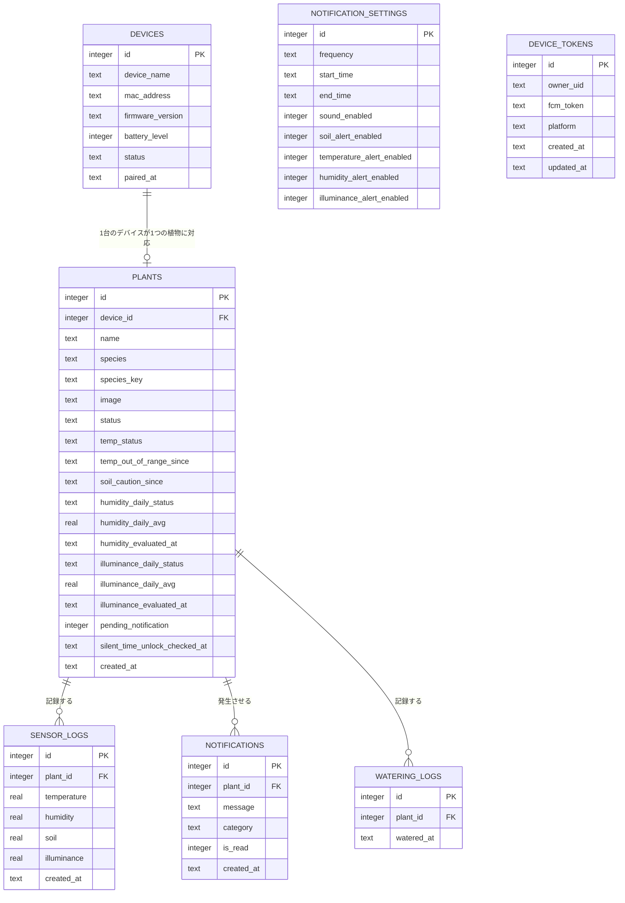

# 設計書

## 1. システム構成

```
センサー(温湿度・土壌水分・照度)
  │
  ▼
ESP32(センサーデバイス)
  │ HTTP(JSON, X-Device-Api-Key)
  ▼
Node.js(APIサーバー) ──requireAuth/requireDeviceAuth── Firebase Authentication(IDトークン検証)
  │                                                └─ Firebase Cloud Messaging(Push通知送信)
  ├── SQLite
  │
  ▼
Flutter(アプリ) ──ログイン── Firebase Authentication
```

## 2. ディレクトリ構成

```
project
│
├── app
│   ├── config
│   ├── data
│   ├── models
│   ├── repositories
│   ├── services
│   ├── state
│   ├── screens
│   │   ├── auth
│   │   ├── onboarding
│   │   ├── home
│   │   ├── plant_info
│   │   ├── history
│   │   ├── notification
│   │   └── settings
│   ├── theme
│   ├── utils
│   ├── widgets
│   └── main.dart
│
├── server
│   ├── routes
│   ├── database
│   ├── controllers
│   ├── middleware      認証(Firebase IDトークン検証・デバイスキー検証)
│   ├── utils
│   └── app.js
│
├── esp32
│   └── plant_sensor_integrated/
│       └── plant_sensor_integrated.ino
│
└── docs
```

## 3. 画面設計

本バージョン(v1)は1台のデバイス・1株の植物のみを管理する単独構成とし、アプリは以下5画面で構成する(複数植物への対応は将来のバージョンで検討する)。

```
ホーム(植物の状態・センサー値表示)
 ├─▶ 植物情報(植物名・植物種の確認・編集)
 ├─▶ 履歴(グラフ表示)
 ├─▶ 通知/アラート(通知一覧 → 詳細確認)
 └─▶ 設定/デバイス登録(デバイス接続・各種設定)
```

ボトムナビゲーション:ホーム / 植物 / 履歴 / 通知 / 設定

### 3-1. ホーム画面

- 登録した植物の状態(アイコン+メッセージ)・最終更新時刻を大きく表示
- 状態アイコンは3段階(元気 / 少し乾いている / 乾燥している)で表示する
- 温度・湿度・土壌水分・照度をカード形式で表示

### 3-2. 植物情報画面

- 植物名(自由入力)・植物種(カタログから選択。モンステラ・パキラ・サンセベリア・ポトスの4種に対応)を確認・編集する
- 紐づくデバイス情報(デバイス名など)を表示

### 3-3. 履歴画面

- 土壌水分・温度・湿度の推移をグラフ表示
- 期間(直近など)でのデータ確認

### 3-4. 通知/アラート画面

- 状態悪化時の通知一覧(例:「土壌水分が少なくなっています」)
- 通知タップでホーム画面へ遷移し、対応後は状態が更新される

### 3-5. 設定/デバイス登録画面

- デバイス接続(デバイス名・MACアドレスの手入力によるペアリング、APIまで接続済み。実機BLE/Wi-Fiスキャンは未実装、5-3章参照)
- 通知設定(サイレントタイム・カテゴリ別ON/OFF)
- デバイス設定(デバイス名・バッテリー残量・ファームウェア確認)
- ログイン/ログアウト(Firebase Authentication)
- ヘルプ・サポート

## 4. ユーザーフロー

> v1企画時点では認証機能を実装しない単一ユーザー構成を前提としていたが、**v2でFirebase
> Authentication(メール/パスワード)によるログイン機能を追加した**。ログイン画面自体は実装済みで、
> `AuthGate`が起動時にログイン状態を見て`LoginPage`/`AppRoot`を振り分ける。ただし現時点では
> 「本人確認のゲート」としての導入であり、ユーザーごとにデータを分離する仕組みではない
> (`plants`・`devices`とも引き続き1レコードのみを運用)。認証の詳細・サーバー側の保護方式は
> [v2-firebase-security-design.md](v2-firebase-security-design.md)を参照。

```
①アプリ起動 → ②ログイン/新規登録 → ③デバイス接続 → ④植物の登録 → ⑤ホーム画面(通常時)
                                                                        │
                                            ⑥通知が届く ◀───────────────┘(状態悪化時)
                                                │
                                            ⑦ホームで詳細を確認
                                                │
                                            ⑧状態が更新される
```

- 初回起動時はログイン/新規登録を経て、そのままデバイス接続 → 植物登録へ進む
- 植物登録(F-08)はアプリ内の登録画面から`POST /plants`まで接続済み(`curl`等での手動登録は不要)
- 通常時:通知が来ていない = 安心という状態を基本とし、毎日アプリを開かなくてもよい設計とする
- その他の操作(植物情報・履歴/記録・通知設定・デバイス設定・ヘルプ)はホームからいつでもアクセス可能とする

## 5. API設計

**v2よりサーバー側にFirebase IDトークンの検証を導入した**。`POST /sensor`(ESP32からの送信)を
除く全APIはログイン必須で、リクエストヘッダーに`Authorization: Bearer <Firebase IDトークン>`が
必要(未指定・無効な場合は401 `UNAUTHENTICATED`)。`POST /sensor`のみESP32向けの別方式
(`X-Device-Api-Key`ヘッダーによる共有シークレット認証)で保護する。詳細は
[v2-firebase-security-design.md](v2-firebase-security-design.md)を参照。ベースURLは
`http://<server-ip>:port/api` とする。

### 5-1. エンドポイント一覧

| Method | URL | 内容 | 対応画面 | 認証 |
|---|---|---|---|---|
| GET | /plants | 植物一覧取得 | ホーム | ログイン必須 |
| POST | /plants | 植物登録 | 設定/植物登録 | ログイン必須 |
| GET | /plants/:id | 植物詳細取得 | 植物詳細 | ログイン必須 |
| PATCH | /plants/:id | 植物情報編集(名前・植物種・デバイス紐付け) | 植物詳細/設定 | ログイン必須 |
| DELETE | /plants/:id | 植物削除 | 設定 | ログイン必須 |
| POST | /plants/:id/waterings | 水やり記録 | ホーム | ログイン必須 |
| GET | /devices | 検出済み/登録済みデバイス一覧取得 | 設定/植物登録 | ログイン必須 |
| POST | /devices/pair | デバイスのペアリング登録(再接続時は再アクティブ化) | 設定/植物登録 | ログイン必須 |
| GET | /devices/:id | デバイス情報取得(バッテリー残量等) | 設定 | ログイン必須 |
| DELETE | /devices/:id | デバイスのペアリング解除(行は削除せず紐付け解除のみ) | 設定 | ログイン必須 |
| PUT | /devices/tokens | Push通知(FCM)トークンの登録・更新 | (アプリ内部・ログイン/トークン更新時) | ログイン必須 |
| DELETE | /devices/tokens | Push通知(FCM)トークンの削除 | (未使用。4-2章参照) | ログイン必須 |
| POST | /sensor | ESP32からのセンサーデータ送信 | (デバイス→サーバー) | デバイス認証(`X-Device-Api-Key`) |
| GET | /history/:plantId | 履歴取得(クエリで期間指定) | 履歴 | ログイン必須 |
| GET | /notifications | 通知一覧取得 | 通知/アラート | ログイン必須 |
| PATCH | /notifications/:id | 通知を既読にする | 通知/アラート | ログイン必須 |
| GET | /settings/notification | 通知設定取得(サイレントタイム・カテゴリ別ON/OFF) | 設定 | ログイン必須 |
| PUT | /settings/notification | 通知設定の更新 | 設定 | ログイン必須 |
| GET | /species | 植物種カタログ取得(モンステラ・パキラ・サンセベリア・ポトスの4種) | 植物情報/植物登録 | ログイン必須 |

### 5-2. 植物 API

**GET /plants レスポンス例**

```json
[
  {
    "id": 1,
    "name": "モンステラ",
    "species": "観葉植物",
    "status": "healthy",
    "temperature": 24.5,
    "humidity": 60,
    "soil": 42,
    "illuminance": 320,
    "updated_at": "2026-07-05T10:35:00"
  }
]
```

> 上記は5-7章時点(土壌水分のみ)の簡略版。実際のレスポンスには、温度・湿度・照度の状態判定([status-notification-design.md](status-notification-design.md))に伴う`temp_status`・`humidity_daily_status`・`humidity_daily_avg`・`illuminance_daily_status`・`illuminance_daily_avg`、水やり記録の`last_watered_at`、植物種選択の`species_key`・`species_info`・`care_profile`(今の季節に応じた管理条件)も含まれる。

**POST /plants リクエスト例**

```json
{
  "name": "モンステラ",
  "species": "観葉植物",
  "device_id": 1,
  "image": "monstera.png"
}
```

- レスポンス:作成された植物オブジェクト(201 Created)

**PATCH /plants/:id リクエスト例**

```json
{ "name": "モンステラ(リビング)" }
```

デバイスペアリング後に紐付けを行う場合は`device_id`も指定できる(存在しないdevice_idを指定した場合は404 DEVICE_NOT_FOUNDを返す)。

```json
{ "device_id": 1 }
```

植物種の選択・切り替え(F-08・植物切り替え機能)には`species_key`を指定する(POST /plants・PATCH /plants/:idの両方で任意項目として受け付ける。存在しないキーの場合は400 VALIDATION_ERROR)。指定すると表示用の`species`テキストはカタログの値(例:「サトイモ科モンステラ属」)で自動的に上書きされる。植物名(`name`、ニックネーム)は`species_key`と完全に独立しており、別途自由入力できる。未指定(既存データ含む)の場合は、閾値・表示情報ともにデフォルト種(モンステラ)へフォールバックする。カタログの詳細は5-3-1章を参照。

```json
{ "species_key": "monstera" }
```

**POST /plants/:id/waterings**(水やり記録)

ホーム画面の「水やりした」ボタンから呼ぶ。リクエストボディは不要。記録後、`last_watered_at`を含む最新の植物状態(201 Created)を返す。土壌水分が要ケアゾーンでも、直近の水やりから2時間以内は「注意」に緩和される(詳細は[status-notification-design.md 3-3章](status-notification-design.md)を参照)。

### 5-2-1. 植物種カタログ API

**GET /species レスポンス例**

```json
[
  {
    "key": "monstera",
    "name": "モンステラ",
    "scientific_name": "サトイモ科モンステラ属",
    "family_name": "サトイモ科",
    "description": "基準",
    "care_tips": ["直射日光を避け、明るい場所で育てましょう。", "..."],
    "soil_moisture_healthy_min": 40
  },
  { "key": "pachira", "name": "パキラ", "scientific_name": "アオイ科パキラ属", "family_name": "アオイ科", "description": "乾燥に強い・水にも強い・寒さにやや弱い", "soil_moisture_healthy_min": 30 },
  { "key": "sansevieria", "name": "サンスベリア", "scientific_name": "キジカクシ科サンセベリア属", "family_name": "キジカクシ科", "description": "4種で最も乾燥・低照度に強い、冬はほぼ断水", "soil_moisture_healthy_min": 15 },
  { "key": "pothos", "name": "ポトス", "scientific_name": "サトイモ科ハブカズラ属", "family_name": "サトイモ科", "description": "4種で最も多湿好き、水切れ(特に夏)に弱い", "soil_moisture_healthy_min": 40 }
]
```

v1はモンステラ・パキラ・サンセベリア・ポトスの4種を固定カタログ(`server/utils/speciesCatalog.js`)として持たせている(DBテーブル化はしていない)。各種のしきい値はモンステラの実測値(`MONSTERA_THRESHOLDS`)をベースに、湿度・土壌水分のしきい値のみ種ごとに調整したもので、温度・照度のしきい値は4種共通(モンステラの値を流用)。将来、利用者自身が植物種を追加できるようにする場合はこの定数をDBテーブル+管理APIに置き換える想定([status-notification-design.md 9章](status-notification-design.md)を参照)。

### 5-3. デバイス API

> **実装メモ(2026年8月)**: 現バージョンはBluetooth/Wi-Fiでの実機スキャン自体は未実装で、データモデル・API(本節)とdevice_id起点のセンサー受信(5-4)を先に実装した段階。アプリ側の`設定/デバイス接続`画面では、デバイス名・MACアドレスを手入力してペアリングする(実機スキャンへの置き換えは別途検討)。

**POST /devices/pair リクエスト例**

アプリがBluetooth/Wi-Fi経由でデバイスを検出した後、サーバーにペアリング情報を登録する。`mac_address`は`AA:BB:CC:DD:EE:FF`形式(コロン区切り16進数)で指定する。

```json
{
  "device_name": "Plant Monitor 01",
  "mac_address": "AA:BB:CC:DD:EE:FF"
}
```

- レスポンス:デバイスオブジェクト。この時点では植物とは紐付いていないため、続けてPATCH /plants/:idで`device_id`を設定する(5-2参照)。
- 同じ`mac_address`のデバイスが既に存在する場合は、新規作成ではなく実機の再接続(電源off/on、Wi-Fi再接続等)とみなし、既存の行を再アクティブ化して200 OKを返す(`id`は変わらない)。新規作成時は201 Createdを返す。
  - 2026年8月上旬までは409 DEVICE_ALREADY_PAIREDでエラーにしていたが、「同じ機体の再接続」は実運用上ごく普通に起こることであり、そのたびにエラーにするのは実態に合っていなかったため変更した(下記DELETE /devices/:idの変更とセット)。

**GET /devices/:id レスポンス例**

```json
{
  "id": 1,
  "device_name": "Plant Monitor 01",
  "mac_address": "AA:BB:CC:DD:EE:FF",
  "battery_level": 85,
  "firmware_version": "1.0.2",
  "status": "connected",
  "paired_at": "2026-08-07T01:00:00Z"
}
```

存在しないIDを指定した場合は404 DEVICE_NOT_FOUNDを返す。

**DELETE /devices/:id**

ペアリング解除。**デバイス行自体は削除しない**(2026年8月上旬までは行ごと削除していたが、それだと同じ実機で再ペアリングした際に新しい連番`id`が振られてしまい、ESP32側の`DEVICE_ID`定数をそのたびに書き換える必要があった。詳細は[デバイス検証ログ01 2026-08-07](device-test-log01.md)を参照)。実際に行うのは以下の2つのみ:

1. 紐付いていた植物の`device_id`を`NULL`に戻す
2. デバイスの`status`を`disconnected`にする

同じ`mac_address`で再度`POST /devices/pair`すれば、同じ`id`のまま`status: connected`に戻る(上記参照)。

### 5-4. センサー API

**POST /sensor リクエスト例**

ESP32はデバイスIDを含めてデータを送信する(植物IDではなくデバイスIDを起点にする)。デバイスと植物は1:1で紐付くため、サーバー側で`plants.device_id`を参照してどの植物のログかを判定する(6章のテーブル定義を参照。デバイスペアリング機能の実装により、2026年8月から本設計で稼働している)。

```json
{
  "device_id": 1,
  "temperature": 24.5,
  "humidity": 61,
  "soil": 40,
  "illuminance": 300
}
```

- サーバー側は受信時に`sensor_logs`へ保存すると同時に、閾値と比較して`plants.status`を更新する(5-7参照)
- バリデーション:`device_id`は正の整数、`soil`は0〜100の数値(必須)、`temperature`は-20〜60、`humidity`は0〜100、`illuminance`は0以上の数値(任意項目は指定時のみ検証)。範囲外・型不正の場合は400 VALIDATION_ERRORを返す。
- `device_id`に紐づく植物が存在しない場合(デバイス未登録、またはデバイスがどの植物にも紐付けられていない場合)は404 PLANT_NOT_FOUNDを返す。

### 5-5. 履歴 API

**GET /history/:plantId?range=7d**

| パラメータ | 内容 |
|---|---|
| range | `24h` / `7d` / `30d`(デフォルト:`7d`) |
| from / to | rangeの代わりに期間を直接指定する場合(ISO8601) |

```json
{
  "plant_id": 1,
  "range": "7d",
  "logs": [
    { "temperature": 24.5, "humidity": 60, "soil": 42, "illuminance": 320, "created_at": "2026-07-05T10:35:00" }
  ]
}
```

### 5-6. 通知 API

**PATCH /notifications/:id リクエスト例**

```json
{ "is_read": true }
```

### 5-7. 状態(status)判定ロジック

`plants.status`(土壌水分ベース、ホーム画面の主アイコンに対応)は、企画当初の固定閾値から、季節別閾値・継続時間・水やり履歴による緩和を考慮したロジックへ拡張済み(`server/utils/plantStatus.js`の`resolveSoilStatus()`)。

| status | 条件(概要) |
|---|---|
| healthy(元気です) | 季節別のhealthy閾値以上 |
| thirsty(少し乾いています) | caution_zoneに6時間以上継続、または要ケアゾーンでも直近の水やりから2時間以内 |
| dry(乾燥しています) | 要ケアゾーン(季節別のneeds_care閾値未満)かつ、水やり緩和の対象外 |

温度・湿度・照度についても同様に閾値・継続時間ベースの判定ロジックが実装されており、`plants`テーブルの`temp_status`・`humidity_daily_status`・`illuminance_daily_status`に保存される(4項目の中で最も深刻なものをホーム画面の通知メッセージに反映する「worst-of方式」)。閾値は植物種ごとの閾値プロファイル(5-2-1章の植物種カタログ)から取得し、v1はモンステラ・パキラ・サンセベリア・ポトスの4種、いずれも実測・公開情報に基づく値を使用する(モンステラが実測ベース、他3種は公開情報に基づく調整値。温度・照度のしきい値は4種共通)。判定ロジック・通知設計の詳細は[status-notification-design.md](status-notification-design.md)を参照。

### 5-8. エラーレスポンス形式

全APIのエラーレスポンスは以下の形式に統一する。

```json
{
  "error": {
    "code": "PLANT_NOT_FOUND",
    "message": "指定された植物が見つかりません"
  }
}
```

| HTTPステータス | 内容 |
|---|---|
| 400 | リクエスト不正(バリデーションエラー) |
| 401 | 認証エラー(`UNAUTHENTICATED`。Firebase IDトークン/デバイスキーが未指定・無効) |
| 404 | 対象リソースが存在しない(例: `PLANT_NOT_FOUND` / `DEVICE_NOT_FOUND`) |
| 500 | サーバー内部エラー |

### 5-9. 認証

v2よりサーバー側の保護を実装済み(v1企画時点は「認証機能を実装しない」前提だったが変更)。

- アプリからのリクエストは`Authorization: Bearer <Firebase IDトークン>`ヘッダーが必須(`server/middleware/require_auth.js`)。
- ESP32からの`POST /sensor`のみ、`.env`の`DEVICE_API_KEY`と一致する`X-Device-Api-Key`ヘッダーで認証する(`server/middleware/require_device_auth.js`)。
- 現状はユーザーごとのデータ分離(誰がどの植物/デバイスにアクセスできるか)までは行っておらず、「ログイン済みかどうか」のみを見る(ログイン済みであれば誰でも同じ1件のplant/deviceにアクセスできる)。詳細・今後の方針は[v2-firebase-security-design.md](v2-firebase-security-design.md)を参照。

## 6. データベース設計(ER図)

v2でFirebase Authenticationを導入したが、ユーザーごとにデータを分離する`users`テーブルは持たせていない(5-9章の通り「本人確認のゲート」としての利用にとどまる)。そのため引き続き`devices`・`plants`を起点としたシンプルな構成であり、本バージョン(v1)では`devices`・`plants`ともに1レコードのみを運用する(単独構成のため)。Push通知用の`device_tokens`のみ、Firebaseのuid(`owner_uid`)に紐づけて保存する(将来の複数ユーザー対応を見据えた設計。詳細は[push-notification-design.md](push-notification-design.md)を参照)。



> `NOTIFICATION_SETTINGS`はアプリ全体で1レコードのみ保持する設定テーブルのため、他テーブルとのリレーションは持たない。`DEVICE_TOKENS`も他テーブルとのFKは持たず、`owner_uid`(Firebaseのuid)で緩やかに紐づく。

### devices

| 列 | 型 | 説明 |
|---|---|---|
| id | INTEGER (PK) | |
| device_name | TEXT | 例:「Plant Monitor 01」 |
| mac_address | TEXT | デバイス識別用(UNIQUE) |
| firmware_version | TEXT | |
| battery_level | INTEGER | 0〜100 |
| status | TEXT | connected / disconnected |
| paired_at | TEXT | ペアリング日時(再接続のたびに更新) |

### plants

| 列 | 型 | 説明 |
|---|---|---|
| id | INTEGER (PK) | |
| device_id | INTEGER (FK → devices.id) | 紐付くデバイス(任意:未接続でも登録可) |
| name | TEXT | ニックネーム(自由入力) |
| species | TEXT | 表示用の植物種テキスト(species_key指定時はカタログの値で自動設定) |
| species_key | TEXT | 植物種カタログ(5-2-1章)のキー。未設定時はモンステラにフォールバック |
| image | TEXT | |
| status | TEXT | healthy / thirsty / dry(土壌水分、5-7のロジックで更新) |
| temp_status | TEXT | healthy / caution / needs_care(温度、リアルタイム評価) |
| temp_out_of_range_since | TEXT | 温度が適正範囲外に入り続けている開始時刻 |
| soil_caution_since | TEXT | 土壌水分がcaution_zoneに入り続けている開始時刻 |
| humidity_daily_status / humidity_daily_avg / humidity_evaluated_at | TEXT / REAL / TEXT | 湿度の日次評価結果・24時間平均・評価時刻(1日1回15:00) |
| illuminance_daily_status / illuminance_daily_avg / illuminance_evaluated_at | TEXT / REAL / TEXT | 照度の日次評価結果・昼間平均・評価時刻(1日1回15:00) |
| pending_notification | INTEGER | サイレントタイム中に悪化があったかどうかのフラグ(0/1) |
| silent_time_unlock_checked_at | TEXT | サイレントタイム解禁チェックを最後に行った時刻 |
| created_at | TEXT | |

### sensor_logs

| 列 | 型 | 説明 |
|---|---|---|
| id | INTEGER (PK) | |
| plant_id | INTEGER (FK → plants.id, ON DELETE CASCADE) | |
| temperature | REAL | |
| humidity | REAL | |
| soil | REAL | |
| illuminance | REAL | |
| created_at | TEXT | UTC(末尾Z付き)で保存 |

### watering_logs

| 列 | 型 | 説明 |
|---|---|---|
| id | INTEGER (PK) | |
| plant_id | INTEGER (FK → plants.id, ON DELETE CASCADE) | |
| watered_at | TEXT | 水やりを記録した時刻(POST /plants/:id/waterings) |

### notifications

| 列 | 型 | 説明 |
|---|---|---|
| id | INTEGER (PK) | |
| plant_id | INTEGER (FK → plants.id) | |
| message | TEXT | |
| category | TEXT | soil / temperature / humidity / illuminance(移行前の行はNULL) |
| is_read | INTEGER | 0 / 1 |
| created_at | TEXT | |

### notification_settings

| 列 | 型 | 説明 |
|---|---|---|
| id | INTEGER (PK) | 常に1レコード(id=1)のみ運用 |
| frequency | TEXT | 例:「必要な時だけ」 |
| start_time | TEXT | サイレントタイム開始(デフォルト20:00) |
| end_time | TEXT | サイレントタイム終了(デフォルト06:00) |
| sound_enabled | INTEGER | 0 / 1 |
| soil_alert_enabled / temperature_alert_enabled / humidity_alert_enabled / illuminance_alert_enabled | INTEGER | カテゴリ別の通知ON/OFF(0/1、デフォルト1)。OFFでも状態判定・バッジ表示自体は止めない |

### device_tokens

| 列 | 型 | 説明 |
|---|---|---|
| id | INTEGER (PK) | |
| owner_uid | TEXT | Firebaseのuid |
| fcm_token | TEXT | FCMトークン(UNIQUE) |
| platform | TEXT | 現状はandroidのみ |
| created_at / updated_at | TEXT | |

## 7. デザインシステム

「植物見守り」のデザインシステムは、自然を感じるやさしい色合いと十分な余白で「安心感」と「見やすさ」を大切にする。

### 7-1. カラー

| 用途 | 名称 | カラーコード |
|---|---|---|
| Primary | Deep Green | #5B7C5A |
| Secondary | Sage | #9CB89C |
| Accent | Beige | #D9C9A3 |
| Background | Ivory | #F8F5F0 |
| Surface | White | #FFFFFF |
| Text | Text Primary | #333333 |
| Status(正常) | Success | #5B7C5A |
| Status(注意) | Warning | #E7A74E |
| Status(要ケア) | Error | #D86A6A |
| Status(情報) | Info | #6CA3BF |

### 7-2. タイポグラフィ

- フォント:Noto Sans JP(Bold 700 / Medium 500 / Regular 400)
- スケール:H1 24px Bold / H2 20px Bold / Body 16px Regular / Caption 14px Regular / Overline 12px Medium

### 7-3. その他

- アイコン:Material Symbols Rounded
- スペーシング:8pxグリッド
- 角丸(Radius):4px / 8px / 16px / 24px / Full
- カード影(Shadow):X0 Y4 Blur16 Opacity15%
- ボトムナビゲーション:ホーム / 植物 / 履歴 / 通知 / 設定 の5項目で統一
- 主なコンポーネント:ボタン(メイン/アウトライン/テキスト)、Chips/Tags(状態表示)、Switch、入力フィールド、状態カード・プラントカード・通知カード・環境カード

## 8. デバイス設計

### 8-1. 部品構成

| # | 部品 | 説明 |
|---|---|---|
| 1 | ATOM Matrix | Wi-Fi/Bluetooth対応マイコンモジュール。センサーデータを収集しアプリへ送信。動作状態を色で表示(緑:正常/橙:注意/赤:エラー) |
| 2 | ATOM PortABC拡張ベース | 拡張機 |
| 3 | ENV Ⅲ | 温度・湿度・気圧センサー(I2C接続、拡張ベースPort A経由) |
| 4 | 土壌水分センサー(M5Stack用 Unit Earth、U019、抵抗式)※ | アナログ出力(ADC接続、ATOM PortABC拡張ベースのPort B経由・GPIO33)。センサー周辺に砂ポケットを設けて運用 |
| 5 | 光センサーユニット(BH1750)※2 | I2C接続(ENV IIIとは別バス。拡張ベースは経由せず、本体のGPIO26(SDA)/GPIO32(SCL)に直接配線) |
| 6 | 小型モバイルバッテリー | USB-C出力 |

※ 土壌水分センサーはU019(抵抗式)→DFRobot Gravity 防水静電容量式土壌水分センサー V2.0(SEN0308、静電容量式)→U019(砂運用)という経緯を経て、最終的にU019に決定した。当初U019で見られた異常値(0固定、4095張り付き、数十ms単位の暴れなど)は培養土との相性(電極接触ムラ)が原因と判明し、砂状の媒体を用いることで安定動作を確認した。なお実装時、ATOM PortABC拡張ベースのPort B経由ではRAW値がADC最大値付近に張り付く現象が再発したため、配線をATOM Matrix本体のGroveポート直挿し(GPIO32)に変更し、安定動作を確認した(拡張ベースPort Bは不採用としていた)。電極の防錆・防水加工が無くM5公式もPOC(検証)用途としている点は変更されないため、長期の腐食・劣化リスクは残存する制約として許容した上での採用である。詳細は[デバイス検証ログ](device-test-log.md)を参照。

※2 光センサーは当初M5Stack用光センサユニット(U021、GPIO接続)を採用予定だったが、購入しようとした時点で品切れとなっており入手できなかった。もともと拡張ベース経由でのI2C/ADCピン競合・ピン不足の懸念も抱えていたため、それらも踏まえて入手可能だったBH1750に変更して採用した。BH1750はENV IIIとは別のI2Cバス(Wire1)に接続するためGPIO32(SCL)を使用する必要があり、上記の土壌水分センサー(GPIO32直挿し)と競合する。そのため**土壌水分センサーの配線を再びPort B経由(GPIO33)に戻している**(下記8-2の注記を参照)。またGPIO33はESP32のADC2系のため、Wi-Fi使用中はADC1系(GPIO32)よりADC精度が不安定になりやすい点にも注意が必要。

### 8-2. 接続構成(ブロック図)

```
ATOM Matrix ──┬─▶ ATOM PortABC拡張ベース ──▶ PortA:ENV Ⅲ(I2C接続、Wireバス・SDA=GPIO25/SCL=GPIO21)
              │                          └─▶ PortB:土壌水分センサー U019(GPIO33、ADC接続、砂ポケット運用)
              ├─▶ 本体GPIO26/32直挿し(拡張ベース非経由):光センサー BH1750(I2C接続、Wire1バス・SDA=GPIO26/SCL=GPIO32)
              │
モバイルバッテリー ─▶ USB-C ─▶ ESP32
```

> **配線の変遷(2026年8月)**:土壌水分センサーは当初ATOM PortABC拡張ベースのPort B経由(GPIO33)で接続していたが、RAW値がADC最大値付近に張り付く現象が発生したため、ATOM Matrix本体のGroveポート直挿し(GPIO32)に変更した(詳細は[デバイス検証ログ 2026-08-04](device-test-log.md)を参照)。その後、光センサー(BH1750)を追加する際にGPIO32をBH1750のI2Cバス(Wire1のSCL)として使う必要が生じたため、**土壌水分センサーの配線を再びPort B経由(GPIO33)に戻している**(`esp32/plant_sensor_integrated/plant_sensor_integrated.ino`のコメント参照)。Port B経由は過去に異常値が出た配線であるため、再配線後は実機でのキャリブレーション(CALIBRATION_MODE)による再検証が必須。**2026-08-21時点で約2週間の実運用を確認し、異常値の再発は見られていない**が、正式なキャリブレーション(SOIL_RAW_DRY/WETの再実測)自体はまだ実施できておらず、今後の課題として残っている(詳細は[デバイス検証ログ01 2026-08-21](device-test-log01.md)を参照)。

### 8-3. デバイス仕様

| 項目 | 内容 |
|---|---|
| 通信方式 | Wi-Fi 2.4GHz |
| 電源 | モバイルバッテリー |
| センサー | 温度・湿度・気圧(ENV Ⅲ、拡張ベースPort A経由)、土壌水分(U019、拡張ベースPort B経由・GPIO33・砂ポケット運用)、照度(BH1750、本体GPIO26/32直挿し・拡張ベース非経由) |
| 動作温度 | 0〜50℃ |
| サイズ | 約35mm × 18mm × 98mm(突起部含まず) |
| 重量 | 約30g |
| 対応アプリ | iOS / Android(専用アプリ) |
| カラー | ミルクホワイト / セージグリーン / グレージュ |

### 8-4. 通信仕様

```
ESP32
  ↓
POST /sensor
ヘッダー: X-Device-Api-Key: <DEVICE_API_KEY>(5-9章参照)
送信
{
  "device_id": 1,
  "temperature": 24.5,
  "humidity": 61,
  "soil": 40,
  "illuminance": 300
}
  ↓
Node.js
  ↓
SQLite保存
  ↓
Flutter
  ↓
GET /plants
```

## 9. データフロー

```
植物
 │
 ▼
センサー
 │
 ▼
ESP32
 │
 ▼
Node.js
 │
 ▼
SQLite
 │
 ▼
Flutter
 │
 ▼
利用者
```
